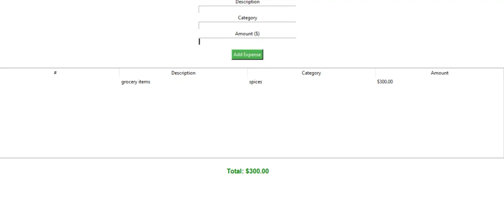
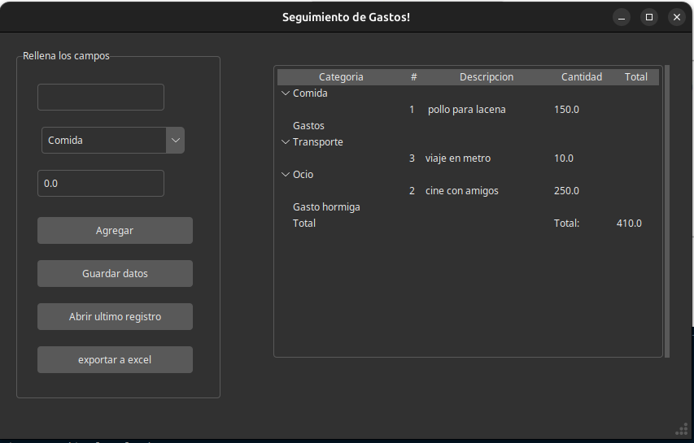

# Track-de-gastos

Esta es una aplicacion de escritorio hecha en python para el control de gastos que se esta generando.

Aun en Desarrollo

# Funciones Extras
Esta aplicaicon es realmente simple asi que decidi hacer las siguientes modificaciones:

- Persistencia de los datos
- Agregar categorias fijas para el tipo de gastos
- Exportar a excel los gastos y datos realizados 

# Mejora de apariencia 
Use la apariencia de [Forest-ttk-theme](https://github.com/rdbende/Forest-ttk-theme) de rdbende 

- Esta es la aparariencia del proyecto original
#
<p align="center">

  
</p>

- Asi es como se ve este proyecto final
#
<p align="center">
  
</p>

## Creditos
Este proyecto originalmente extraido de la pagina Code With curious el proyecto expense tracer in python using GUI
por Shivakshi Chouhan.

[Sitio original](https://codewithcurious.com/)


## Deployment

Para correr este proyecto ingresa el siguiente comando

```bash
  python main.py
```

Algunas dependencias extra que use en este proyecto fue pandas y por lo tanto openpyxl
las cuales se pueden instalar por los siguientes comandos:

```bash
  python -m pip install openpyxl
```

```bash
  python -m pip install pandas
```

## 🔗 Links

[[Code with curious]](https://codewithcurious.com/projects/expense-tracer-in-python-using/)
## 🛠 Lenguajes y herramientas


## Other Common Github Profile Sections
👩‍💻 Actualmente trabajando en proyectos para mi portafolio

🧠 Actualmente estoy interesado en: python, JavaScript, React

📫 Contactame: [Mi linkedin](www.linkedin.com/in/samuel-salcedo-lucero-8a26041b8)

## Licencias

[](https://choosealicense.com/licenses/mit/)

[](https://opensource.org/licenses/)

[](http://www.gnu.org/licenses/agpl-3.0)

